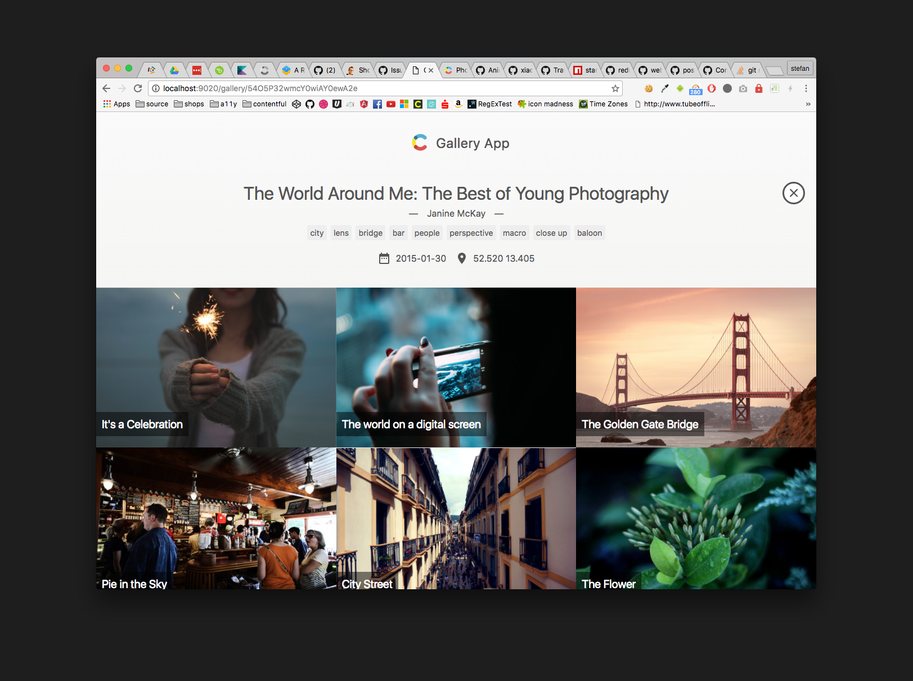

# Gallery

This is a React application example for the [Contentful][1] gallery space template.

[Contentful][1] is a content management platform for web applications, mobile apps and connected devices. It allows you to create, edit & manage content in the cloud and publish it anywhere via powerful API. Contentful offers tools for managing editorial teams and enabling cooperation between organizations.

## Usage

- create a space with the "Gallery" space template on [Contentful][1]
- clone this repo and run `npm i`
- edit `deliveryAccessToken`, `spaceId` and `galleryTypeId` (id of the content type `Photo Gallery`) in `config.js` included in the project root
- run `npm start`
- open `localhost:9020/` to see it in action

## License

Copyright (c) 2016 Contentful GmbH. See LICENSE for further details.

[1]: https://www.contentful.com
